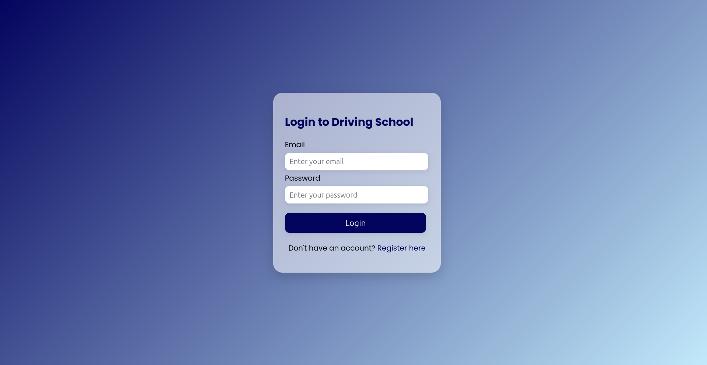
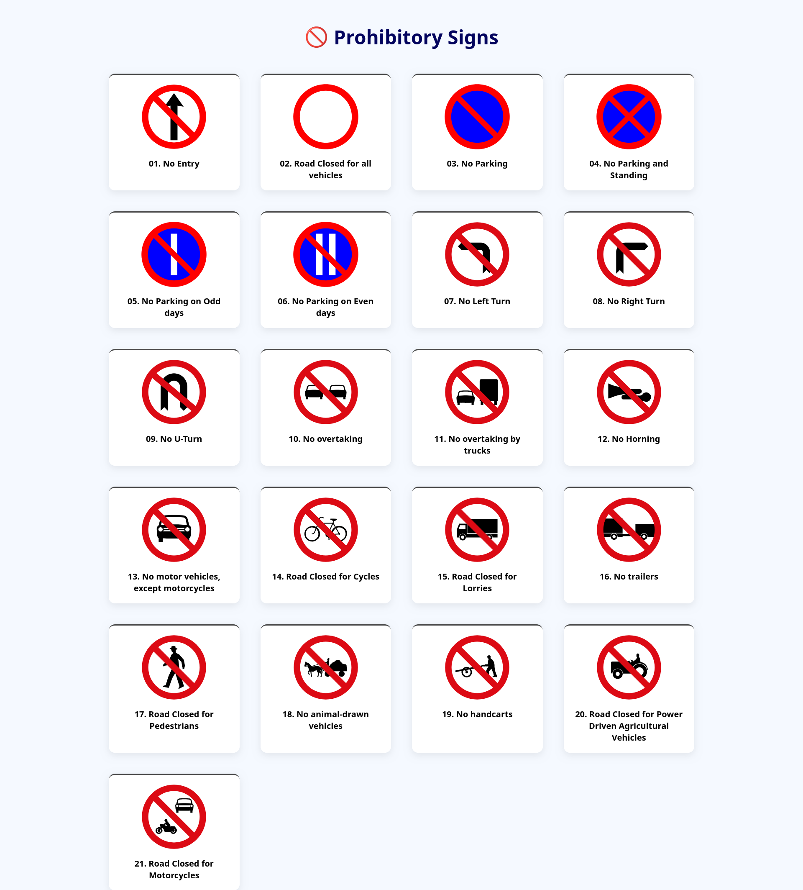
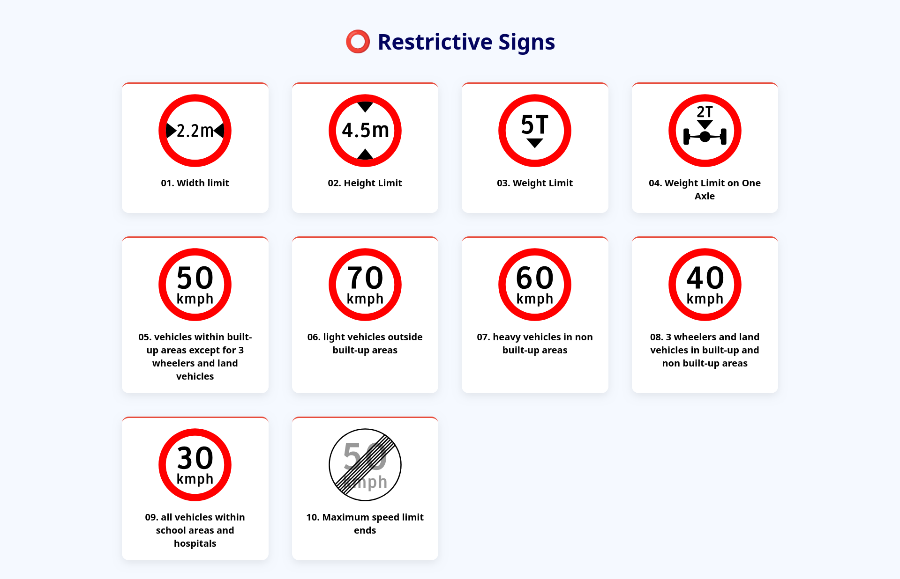
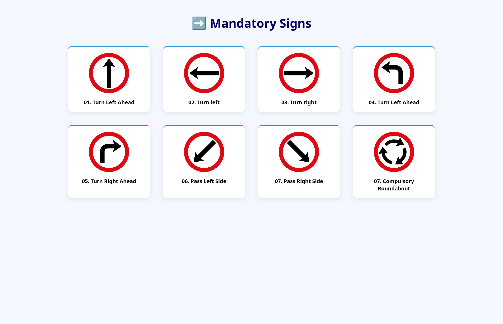
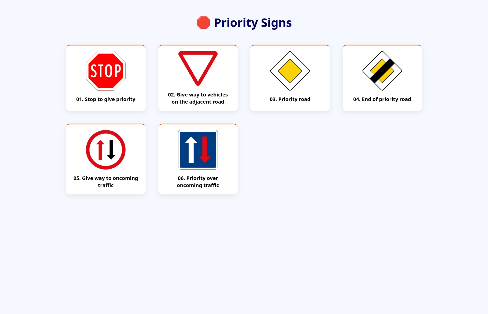
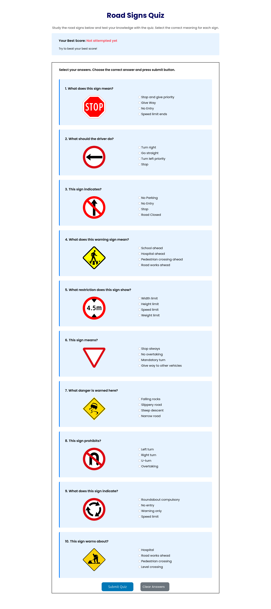
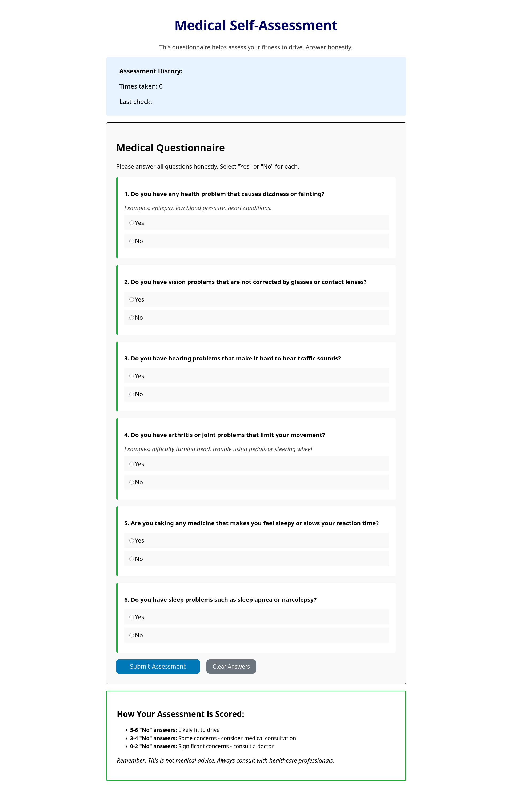

# Driving School Learning System

A responsive web application designed to help learners prepare for the Sri Lankan driving licence theory examination. The system provides road-sign learning materials, interactive quizzes, user authentication, and a medical self-assessment module.

## Features

- User registration and secure login
- Road-sign learning modules
- Warning, prohibitory, restrictive, mandatory, and priority sign categories
- Interactive road-sign quiz
- Medical self-assessment module
- Responsive and user-friendly interface

## Technologies Used

- PHP
- MySQL
- HTML5
- CSS3
- JavaScript

## Screenshots

### Home Page


### User Registration


### User Login



### Road Signs


### Warning Signs


### Prohibitory Signs



### Restrictive Signs



### Mandatory Signs



### Priority Signs



### Road Signs Quiz



### Medical Self-Assessment



## Installation

1. Clone the repository:

   ```bash
   git clone https://github.com/thavinduharshana53-commits/DrivingSchool-Learning-System.git
   ```

2. Move the project into your XAMPP `htdocs` directory.
3. Start Apache and MySQL using the XAMPP Control Panel.
4. Create a MySQL database using phpMyAdmin.
5. Import the project's SQL file into the database.
6. Update the database connection details in the PHP configuration file.
7. Open the project in your browser:

   ```text
   http://localhost/DrivingSchool-Learning-System/
   ```

## Hosting

GitHub Pages cannot run this complete application because it supports only static HTML, CSS, and JavaScript files. PHP requires a server, and MySQL requires a database service. Deploy the application using a PHP-compatible hosting provider.

## Author

**Thavindu Harshana**

- GitHub: [thavinduharshana53-commits](https://github.com/thavinduharshana53-commits)
- LinkedIn: [Thavindu Harshana](https://www.linkedin.com/in/thavindu-harshana-771094378/)

## License

This project was developed for educational purposes.
